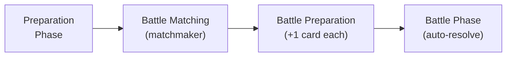
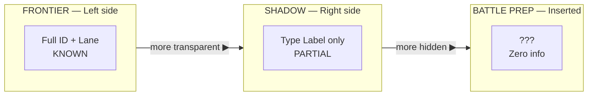

# Card Battle Game — Design Document v4.0

> **Objective:** Win 10 battles (trophies) within a match to achieve victory. All matches are strictly 1:1 — one player versus one player.

---

## 1. Game Flow

### 1.1 Preparation Phase
- **Deploy** cards continuously from left to right (no gaps allowed).
- **Zone Positioning:** Cards must strictly follow a left-to-right zone order:
  - **Frontier** (Left side, up to 3 cards) — visible to opponent: identity + lane
  - **Shadow** (Right side, up to 3 cards) — visible to opponent: type label only
- **Order constraint:** The left side (Frontier) must be filled before placing Shadow cards.
- **Modification:** Insertion and deletion are only allowed at a specific position, shifting the sequence left or right while maintaining a contiguous array.

### 1.2 Battle Matching
- All matches are **strictly 1:1** — one player versus one player.
- Rooms support **2, 4, or 6 players** (even numbers only). Odd counts are not
  permitted because they cannot form complete 1:1 pairings.
  - 2-player room → 1 simultaneous 1:1 match
  - 4-player room → 2 simultaneous 1:1 matches
  - 6-player room → 3 simultaneous 1:1 matches
- Players join a named room directly — no global matchmaking queue.
- **The game does not start until all seats in the room are filled.** Players
  who join early wait in a lobby state; no game actions are accepted until the
  room reaches its declared capacity.
- **Player roster is locked at game start.** No player may join or be
  substituted once the game has begun; the participant list is fixed for the
  entire match.
- Within a room, the server pairs players using a **round-robin schedule** —
  every player faces every other player in turn.
- **Win condition:** The first player to win **10 battles (trophies)** wins the
  match. A Double KO awards no trophy to either player for that battle.

### 1.3 Battle Preparation
- Each player selects **1 card from reserve** and inserts it at **any position** in their lane sequence.
- **Insertion Mechanic:** Placing this card shifts all subsequent cards one slot to the right.
- This card occupies a **special zone** — completely hidden (no type label, no lane info) until its lane resolves.
- Both players can see each other's Frontier cards (identity + lane).
- Both players can see each other's Shadow card **type labels only**.
- Battle Prep card is available from **Round 3** onward (requires reserve cards).

### 1.4 Battle Phase
- Cards resolve **automatically** lane-by-lane, left to right.
- **Reveal style:** Poker — slow, lane-by-lane card flip.
- **100% Collision:** Because both players deploy continuously from left to right with the same deck size, cards will always clash head-to-head.

---

## 2. Battle System

### 2.1 Structure

| Property      | Value                                               |
| ------------- | --------------------------------------------------- |
| Lanes         | **7** (Maximum sequence length)                     |
| HP            | 30 (shared pool per player)                         |
| Win condition | Reduce enemy HP to 0                                |
| Double KO     | Both reach 0 simultaneously → **no trophy awarded** |
| Deck size     | **9**                                               |
| Deploy        | **6** (Prep) + **1** (Battle Prep) = **7 max**      |
| Reserve       | Deck − deployed cards (2 at full deck)              |
| Reveal        | Lane-by-lane, poker-style tension                   |

### 2.2 Lane Resolution

For each lane (left to right):
  1. Both cards are revealed simultaneously
  2. Lower priority number activates FIRST
  3. Higher priority number activates SECOND
  4. If same priority → SIMULTANEOUS (both activate, both take effect)
  5. Proceed to next lane

### 2.3 Information Zones — Three-Tier Visibility

| Zone            | Count | Opponent Sees                                | Hidden                      |
| --------------- | ----- | -------------------------------------------- | --------------------------- |
| **Frontier**    | 3     | Exact card + lane                            | Nothing                     |
| **Shadow**      | 3     | Type label (Disrupt/Shield/Buff/Strike/Nuke) | Specific card + lane        |
| **Battle Prep** | 1     | Nothing — completely hidden                  | Card identity + type + lane |

### 2.4 Deployment by Round

| Round | Deck | Frontier | Shadow | Battle Prep | Reserve |
| ----- | ---- | -------- | ------ | ----------- | ------- |
| R1    | 3    | 3        | 0      | —           | 0       |
| R2    | 5    | 3        | 2      | —           | 0       |
| R3    | 7    | 3        | 3      | 1           | 0       |
| R4+   | 9    | 3        | 3      | 1           | 2       |

**Early-round dynamics:**
- **R1:** Pure priority trading — 3 Frontier cards clash head-to-head, fully visible.
- **R2:** Shadow introduced — partial information enters the right side of the board.
- **R3:** Full system online — BP insertion acts as a timeline manipulator, shifting alignments.
- **R4+:** Reserve pool adds benching decisions on top of full deployment.

---

## 3. Economy System

### 3.1 Card Selection Mechanic (Universal)

Every card pick:
  → Shown 3 random cards from the 25-card pool
  → Choose 1
  → Each pick is independent (1 selection per card)

### 3.2 Three Economic Phases

PHASE 1 — BUILDING (Game Start → Round 3)
════════════════════════════════════════════════════════════
  Purpose: Construct your deck from 0 → 9 cards

  Game Start │ 3 picks (each: shown 3, choose 1) │ deck = 3
  R1 end     │ 2 picks (each: shown 3, choose 1) │ deck = 5
  R2 end     │ 2 picks (each: shown 3, choose 1) │ deck = 7
  R3 end     │ 2 picks (each: shown 3, choose 1) │ deck = 9

PHASE 2 — REPLACEMENT (Round 4 → Round 9)
════════════════════════════════════════════════════════════
  Purpose: Sculpt and refine — swap weak cards for better fits

  Each round │ Must discard 1 card                            │ deck → 8
             │ Then 1 pick (shown 3, choose 1)                │ deck → 9

PHASE 3 — REINFORCEMENT (Round 10+)
════════════════════════════════════════════════════════════
  Purpose: Late-game power escalation

  Each round │ Must upgrade 1 card's tier (T1→T2 or T2→T3)     │ deck = 9
             │ Mandatory — cannot skip                         │
             │ Deck size frozen, card power increases          │

### 3.3 Phase Design Rationale

| Phase             | Rounds   | Core Tension                                                |
| ----------------- | -------- | ----------------------------------------------------------- |
| **Building**      | Start–R3 | "What archetype am I building?" — draft identity            |
| **Replacement**   | R4–R9    | "What doesn't fit?" — refine synergies, adapt to meta       |
| **Reinforcement** | R10+     | "What's my win condition?" — invest upgrades into key cards |

---

## 4. Card Design

→ See [card_design.md](card_design.md) for card anatomy, types, rules, and the full catalog.

---

## 5. Key Interactions Matrix

| You Play →  | vs Disrupt (P0)                    | vs Shield (P1)                                               | vs Buff (P2)                                               | vs Strike (P3)                             | vs Nuke (P4)                                             |
| ----------- | ---------------------------------- | ------------------------------------------------------------ | ---------------------------------------------------------- | ------------------------------------------ | -------------------------------------------------------- |
| **Disrupt** | Both weaken each other's next card | Weakens shield                                               | Weakens buff effect                                        | Weakens strike damage                      | Weakens nuke damage (condition unaffected)               |
| **Shield**  | Shield weakened by disrupt         | Both waste if they are only for the single lane, both survives if they are the lasting shield | Shield blocks nothing, survives if they are lasting shield | Shield absorbs strike                      | Shield absorbs nuke                                      |
| **Buff**    | Buff weakened by disrupt           | Buff survives (no damage)                                    | Both buff (no damage)                                      | **Buff broken or weakened by strike**      | **Buff broken or weakened by nuke**                      |
| **Strike**  | Strike weakened                    | Strike absorbed                                              | Strike breaks or weakens enemy buff                        | **Simultaneous damage**                    | Strike fires first, nuke still hits (if condition met)   |
| **Nuke**    | Nuke weakened                      | Nuke absorbed (if condition met)                             | Nuke breaks or weakens enemy buff (if condition met)       | Nuke fires after strike (if condition met) | **Simultaneous massive damage (if both conditions met)** |

---

## 6. Open Design Questions (TODO)

### Card Design (Refinement)
- [ ] Upgrade paths (what improves per tier? stats only confirmed)
- [ ] Card art direction and visual identity
- [ ] Keyword glossary for player-facing text
- [ ] Duplicate cards — can a deck contain two copies of the same card?

### Balance
- [ ] Damage/shield number tuning (playtest required)
- [ ] Buff percentage ranges vs. flat damage tradeoffs
- [ ] Disrupt weaken percentage sweet spots
- [ ] Conditional thresholds (HP ≤ 10, HP ≤ 12 — need playtesting)

### Economy (Refinement)
- [ ] Card pool filtering — can you see cards already in your deck in the random 3?
- [ ] Replacement phase — can you discard and pick the same card back?
- [ ] Reinforcement — what if all 9 cards are already T3?

### UX / Presentation
- [ ] Battle animation pacing
- [ ] Frontier/Shadow/Battle Prep visual distinction
- [ ] Post-battle replay/review system
- [ ] Victory/defeat feedback

### Technical
- [ ] PvP vs. PvE vs. both
- [ ] Target engine/framework