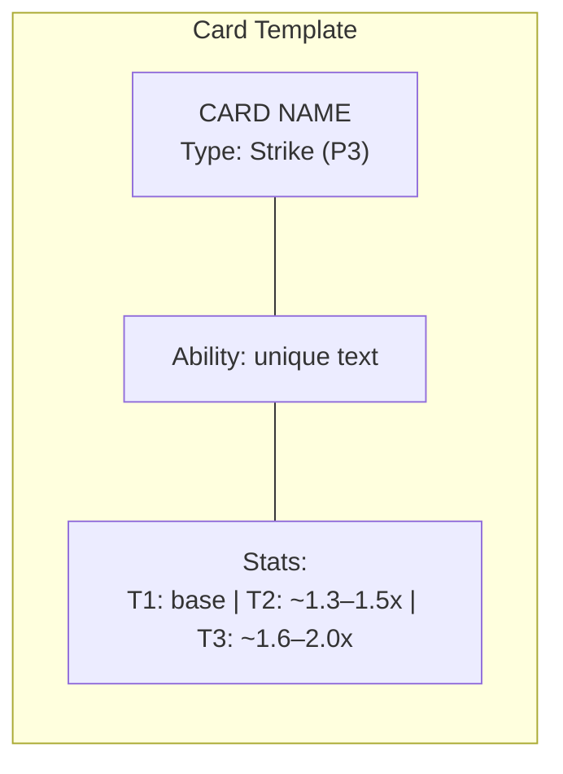

# Card Design

---

## 1. Card Anatomy

- Each card has a **unique ability**
- **Rarity = Tier** — same ability, higher stats
- 3 tiers: T1 (Common), T2 (Rare), T3 (Epic)

### Card Pool — 22 Cards

Disrupt (P0):  4 cards
Shield  (P1):  4 cards
Buff    (P2):  4 cards  (2 subtypes × 2)
Strike  (P3):  6 cards
Nuke    (P4):  4 cards
               ──
Total:         22

---

## 2. Card Types & Priority

### 2.1 Priority Table

| Priority | Type    | Deals Damage?               | Cross-Lane?       | Role                          |
| -------- | ------- | --------------------------- | ----------------- | ----------------------------- |
| **P0**   | Disrupt | Tier-dependent (none → low) | No                | Weaken enemy card's effect    |
| **P1**   | Shield  | No                          | No                | Absorb incoming damage        |
| **P2**   | Buff    | No                          | **Yes** (fragile) | Modify stats for future lanes |
| **P3**   | Strike  | Medium (reliable)           | No                | Reliable damage dealer        |
| **P4**   | Nuke    | High (conditional)          | No                | Conditional heavy damage      |

### 2.2 Disrupt Rules
- **Weaken only** — never fully nullify an enemy card.
- **Scaling %** — better Disrupt cards have higher weaken percentage.
- **Damage:** Tier-dependent. T1 Disrupts deal no damage; T2/T3 deal small chip damage.
- **Weaken targets primary stat:**
  - vs Strike/Nuke → reduce damage
  - vs Shield → reduce absorption
  - vs Buff → reduce buff %
  - vs Disrupt → reduce their weaken %

### 2.3 Shield Rules
- Absorbs damage directed at HP pool.
- Wasted if enemy didn't play a damage card in that lane.
- Does not deal damage.
- **Stacking (multiple active shields):**
  - **Additive totals:** Total absorption = Shield A value + Shield B value.
  - **Damage priority (FIFO):** The earliest-activated shield absorbs incoming damage first; later shields absorb only the remainder.
  - **Independent expiration:** Each shield is tracked separately and expires at the end of its own duration, regardless of other active shields.

### 2.4 Buff Rules
- **No damage** in the buff's own lane (enemy gets a free lane).
- **Cross-lane:** Buff effects apply to cards in subsequent lanes.
- **Fragile:** Buff is **broken** if the buff card takes damage in its lane.
- **Failed condition = dead card** — gives up the lane for nothing.
- **Buff application:** Each hit resolves independently (relevant for Twin Strike).

### 2.5 Nuke Rules
- **Conditional damage** — each Nuke has a specific condition that must be met.
- **If condition fails:** Nuke deals 0 damage (dead card).
- **If condition met:** High damage, highest in the game.
- **Disrupt vs Nuke:** Weakens damage only, condition is unaffected.

### 2.6 Conditional Buff Subtypes

| Subtype         | Trigger Condition                      | Playstyle          |
| --------------- | -------------------------------------- | ------------------ |
| **Desperation** | HP below a threshold                   | Control / Comeback |
| **Formation**   | Adjacent lane has a specific card type | Combo / Puzzle     |

---

## 3. Card Catalog

### 3.1 Disrupt (P0) — 4 Cards
| #    | Name         | Ability                            | Weaken% (T1/T2/T3)                  | Chip Dmg (T1/T2/T3) |
| ---- | ------------ | ---------------------------------- | ----------------------------------- | ------------------- |
| 1    | **Sabotage** | Reduce enemy card's primary effect | 30/40/50%                           | 0/1/2               |
| 2    | **Expose**   | Weaken + reveal next Shadow card   | 20/30/40%                           | 0/0/1               |
| 3    | **Siphon**   | Weaken + gain small shield         | 25/35/45%                           | 0/0/1               |
| 4    | **Hex**      | Bonus weaken vs Buff or Nuke       | 20/30/40% (+20/25/30% vs Buff/Nuke) | 0/1/2               |

### 3.2 Shield (P1) — 4 Cards
| #    | Name        | Ability                                                | Absorb (T1/T2/T3) |
| ---- | ----------- | ------------------------------------------------------ | ----------------- |
| 1    | **Barrier** | Pure absorption                                        | 6/8/11            |
| 2    | **Reflect** | Absorb + reflect 30% back as damage                    | 4/6/8             |
| 3    | **Aegis**   | If overkill, carry leftover shield to next lane        | 5/7/10            |
| 4    | **Taunt**   | Absorb + forces adjacent enemy lane to also target you | 4/5/7             |

### 3.3 Buff (P2) — 4 Cards

**Desperation Subtype** (trigger: your HP ≤ threshold)

| #    | Name           | Ability                                                        | Condition         | Buff% (T1/T2/T3)       |
| ---- | -------------- | -------------------------------------------------------------- | ----------------- | ----------------------- |
| 1    | **Rally**      | Boost damage of all subsequent allied Strike/Nuke cards        | Your HP ≤ 15      | +25/+35/+50% damage    |
| 2    | **Last Stand** | Grant shield to all subsequent allied cards (absorbs per card) | Your HP ≤ 10      | 3/4/6 absorb per card  |

**Formation Subtype** (trigger: adjacent lane has specific card type)

| #    | Name           | Ability                                                              | Condition                       | Buff% (T1/T2/T3)       |
| ---- | -------------- | -------------------------------------------------------------------- | ------------------------------- | ----------------------- |
| 3    | **War Drum**   | Boost damage of all subsequent allied Strike cards                   | Adjacent lane has a Strike card | +30/+40/+55% damage    |
| 4    | **Vanguard**   | Boost absorption of all subsequent allied Shield cards               | Adjacent lane has a Shield card | +25/+35/+50% absorb    |

**Buff rules reminder:**
- No damage in the buff's own lane (enemy gets a free lane).
- Cross-lane: effects apply to cards in **subsequent** (higher-numbered) lanes only.
- **Fragile:** If the buff card takes damage in its own lane, the buff is broken and has no effect.
- **Failed condition = dead card:** If the subtype condition is not met, the buff does nothing.

### 3.4 Strike (P3) — 6 Cards
| #    | Name            | Ability                                        | Dmg (T1/T2/T3)           |
| ---- | --------------- | ---------------------------------------------- | ------------------------ |
| 1    | **Slash**       | Pure damage                                    | 5/7/9                    |
| 2    | **Pierce**      | Ignores 50% of shield                          | 4/5/7                    |
| 3    | **Drain**       | Deals damage + heals you                       | 3 dmg +2 hp / 4+3 / 6+4  |
| 4    | **Twin Strike** | Hits twice (each hit buffed independently)     | 2+2 / 3+3 / 4+4          |
| 5    | **Riposte**     | Bonus damage if enemy played Disrupt this lane | 3 (+4) / 4 (+5) / 5 (+7) |
| 6    | **Executioner** | Bonus damage if enemy HP ≤ 10                  | 3 (+4) / 4 (+5) / 5 (+7) |

### 3.5 Nuke (P4) — 4 Cards
| #    | Name           | Condition                        | Dmg (T1/T2/T3) |
| ---- | -------------- | -------------------------------- | -------------- |
| 1    | **Meteor**     | Enemy played no Shield this lane | 10/13/16       |
| 2    | **Guillotine** | Enemy HP ≤ 10                    | 12/15/18       |
| 3    | **Ambush**     | This card was in Shadow zone     | 9/12/15        |
| 4    | **Despair**    | Your HP < enemy HP               | 11/14/17       |
