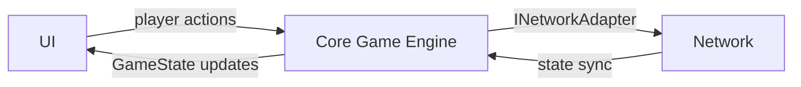
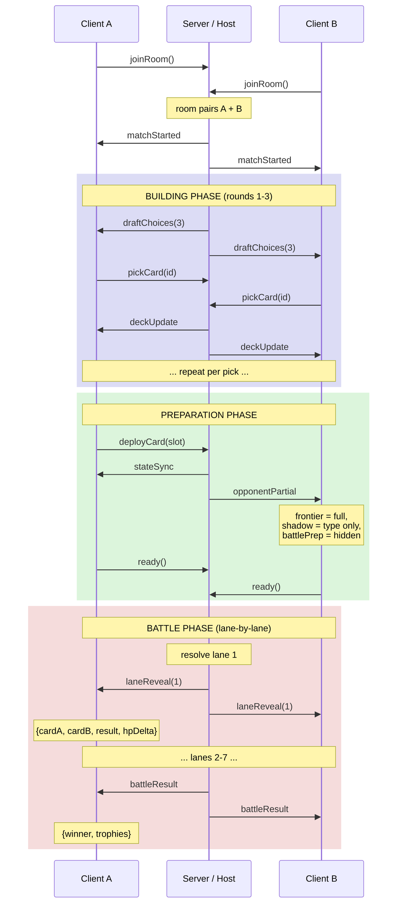
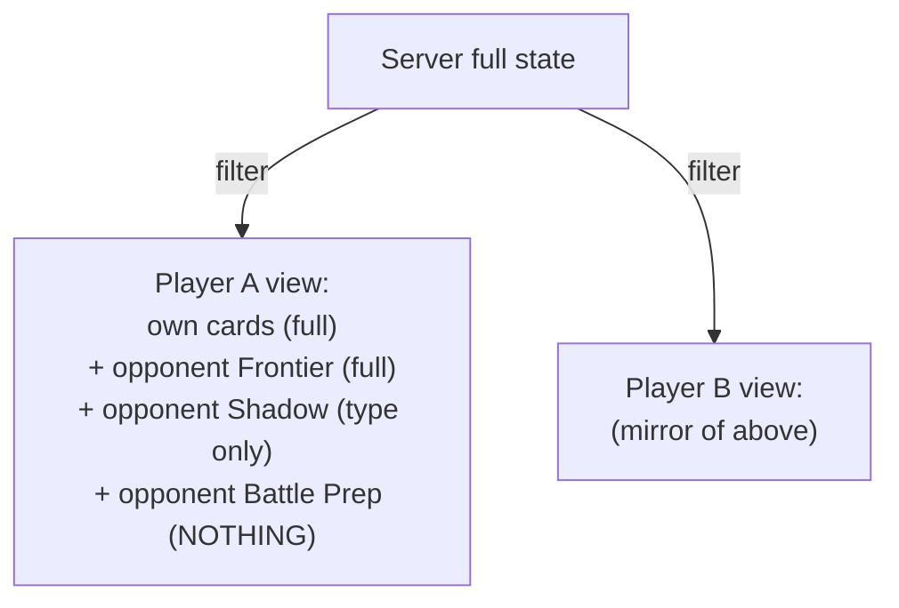
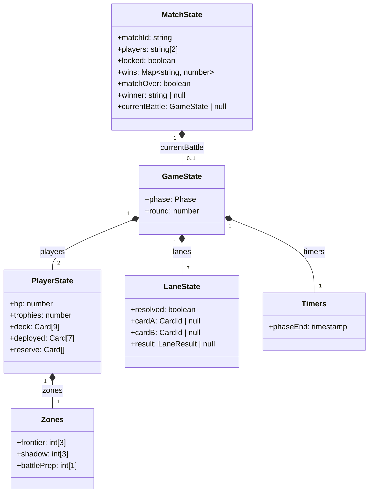
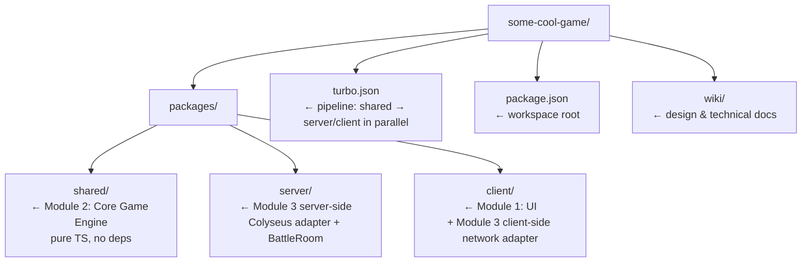

# Technical Specification — Card Battle Game

> **Version:** 1.0
> **Status:** Draft
> **Companion docs:** [GDD v4.0](GDD.md) · [Card Design](card_design.md)

---

## 1. Tech Stack

| Layer              | Choice                  | Rationale                                                                  |
| ------------------ | ----------------------- | -------------------------------------------------------------------------- |
| **Language**       | TypeScript (strict)     | Shared types between client and server; catches card-logic bugs at compile time |
| **Rendering**      | PixiJS 8                | Lightweight 2D WebGL renderer; ideal for card animations without Phaser's overhead |
| **UI Overlay**     | Preact + HTM            | Thin reactive layer for HUD, menus, lobby — renders to DOM above the Pixi canvas |
| **Networking**     | Colyseus 0.15           | Authoritative game rooms, schema-based state sync over WebSocket           |
| **Server**         | Node.js 20 + Colyseus   | Colyseus runs on Node; no separate HTTP framework needed for game logic    |
| **Monorepo**       | Turborepo + pnpm        | Three packages: `client`, `server`, `shared` with single `tsconfig` base  |
| **Build (client)** | Vite 6                  | Fast HMR, native TS, trivial Pixi asset pipeline                          |
| **Build (server)** | tsx (dev) / tsup (prod) | Fast dev reload; single-file production bundle                             |
| **Testing**        | Vitest + Playwright     | Unit tests for shared game logic; E2E for full client-server flows         |
| **Linting**        | Biome                   | Single tool for format + lint; faster than ESLint + Prettier               |

### Why PixiJS over Phaser

Phaser bundles a physics engine, scene manager, and input system designed for action games. This card game needs none of those — it needs sprite rendering, tweened animations (card flips, slide-ins), and layered containers for zones. PixiJS is roughly 1/3 the bundle size and gives full control over the render loop without fighting a framework.

### Why Colyseus over raw WebSocket

The game has well-defined rooms (1v1 matches), phased state transitions, and needs authoritative validation. Colyseus provides room lifecycle, delta-compressed state sync, reconnection, and room pairing out of the box. Its schema system maps naturally to the lane/card data model.

---

## 2. Module Structure

Three core modules with clean interfaces between them. Any layer can be swapped independently — e.g., the network module can move from central server to P2P without touching game logic or UI.

### 2.1 Module Diagram

- **UI → Core:** "Player wants to deploy card X at slot 3" (intent)
- **Core → Network:** "Validated action, broadcast to opponent" (via adapter)
- **Network → Core:** "Opponent deployed card Y" (incoming action)
- **Core → UI:** "State updated, re-render" (new GameState)

### 2.2 Module 1: UI

Responsible for rendering, input, and presentation. Knows nothing about networking.

| Sub-module         | Responsibility                                                                                    |
| ------------------ | ------------------------------------------------------------------------------------------------- |
| `scenes/`          | Pixi containers: PrepScene, BattleScene, DraftScene — one active at a time                        |
| `rendering/`       | CardSprite (3 visual states: hidden / type-only / full), Animator (card flips, lane reveals, FX)   |
| `components/`      | Preact HUD overlay — HP bar, round counter, phase indicator, card tooltips, menus                  |
| `state/ViewModel`  | Derives displayable state from the Core Engine's GameState, respecting visibility zone rules       |

**Interface:** Consumes `GameState` (read-only) from Core Engine; emits player actions (`deployCard`, `pickCard`, `ready`, etc.) as intents.

### 2.3 Module 2: Core Game Engine

Pure game logic — deterministic, platform-agnostic, no I/O. This is the shared brain that runs identically on client, server, or P2P host.

| Sub-module          | Responsibility                                                                                                |
| ------------------- | ------------------------------------------------------------------------------------------------------------- |
| `types/`            | All interfaces and enums: `Card`, `GameState`, `PlayerState`, `LaneResult`, `Phase`, `CardType`, `Tier`       |
| `cards/catalog`     | 25-card catalog as typed constant map — id, name, type, priority, base stats, tier scaling, ability descriptor |
| `cards/abilities`   | Pure functions for each ability's effect signature (inputs/outputs)                                            |
| `rules/lane`        | `resolveLane(cardA, cardB, context): LaneResult` — priority ordering, disrupt, shields, buffs, nukes          |
| `rules/economy`     | Phase transition logic — which picks/discards/upgrades are legal given the current round                      |
| `rules/deploy`      | Zone constraints (Frontier before Shadow), contiguous placement, Battle Prep insertion shifting                |
| `engine/PhaseManager` | State machine: BUILDING → PREP → MATCHING → BATTLE_PREP → BATTLE → RESULT                                  |
| `engine/MatchManager`  | Multi-battle match envelope — round-robin pairing schedule, trophy tracking (per-round KO or HP-lead), lobby-wait enforcement, roster-lock, and match-over condition (first player to accumulate 10 trophies) |
| `engine/Validator`  | Validates any player action against current state — anti-cheat layer when run server-side                     |

**Interface:** Exposes `applyAction(state, action): GameState`, `resolveLane()`, and `applyBattleResult(matchState, result): MatchState`. No side effects, fully testable.

### 2.4 Module 3: Network

Abstracted transport layer. Defines interfaces so the implementation can be swapped without touching game logic or rendering.

| Sub-module             | Responsibility                                                                                        |
| ---------------------- | ----------------------------------------------------------------------------------------------------- |
| `interface/`           | `INetworkAdapter` — `connect()`, `sendAction()`, `onStateUpdate()`, `onLaneReveal()`, etc.            |
| `adapters/colyseus/`   | Central server adapter — authoritative Colyseus rooms, schema sync, room pairing                       |
| `adapters/p2p/`        | (Future) P2P adapter — WebRTC DataChannels, one peer acts as host running the Core Engine              |
| `server/BattleRoom`    | Colyseus `Room` subclass — visibility filtering, phase timers, routes actions to Core Engine; delegates match lifecycle to `MatchManager` |
| `messages/`            | Typed message definitions shared by all adapters                                                       |

**Matchmaking:** Rooms support **2, 4, or 6 players only** (even numbers; odd counts are rejected because they cannot form complete 1:1 pairings). All matches within a room are strictly **1:1 (one player vs. one player)**. A 4-player room runs 2 simultaneous 1:1 matches; a 6-player room runs 3.

There is no global queue — players join a named room directly. **The game does not start until all seats are filled**; early arrivals wait in a lobby state and no game actions are accepted until the room reaches capacity. **The player roster is locked at game start** — no joins or substitutions are permitted once the match is in progress.

Within a room, pairing follows a **round-robin schedule** so that every player faces every other player in turn. `BattleRoom` handles transport-level seat assignment only; all match lifecycle concerns (round-robin scheduling, win tracking, lobby-wait, roster-lock, match-over detection) are the responsibility of `engine/MatchManager` in the Core module.

**Interface:** UI and Core Engine interact with Network only through `INetworkAdapter`. Swapping from Colyseus to P2P requires zero changes to game logic or rendering.

---

## 3. Authority Model

The server (or host peer in P2P) is the single source of truth. The client is a view layer that sends intents and renders confirmed state.

### Server / Host owns

| Concern                | Detail                                                             |
| ---------------------- | ------------------------------------------------------------------ |
| Card resolution        | All lane outcomes computed via `shared/rules/lane`                 |
| Visibility enforcement | Hidden card data never sent to opponent until reveal time          |
| Deploy validation      | Every placement checked against zone rules and deck contents       |
| Economy validation     | Draft picks, discards, upgrades validated against phase rules      |
| Timers                 | Phase duration enforced; auto-advance on timeout                   |
| Randomness             | Card draft pool (3 random from 25) generated server-side           |

### Client owns

| Concern                | Detail                                                             |
| ---------------------- | ------------------------------------------------------------------ |
| Animation pacing       | Controls reveal animation speed (within server timeout)            |
| UI layout              | Card arrangement, drag targets, cosmetic preferences               |
| Input                  | Which card to play where — sent as intent, validated by server     |

Because Core Engine is a standalone module, it runs identically whether hosted on a dedicated server (Colyseus) or on a host peer (P2P). The network adapter determines *where* it runs, not *how*.

---

## 4. Data Flow

### 4.1 Match Lifecycle

The diagram above shows a single battle. A full match consists of repeated battles until one player accumulates 10 trophies (awarded per round: KO opponent or end with higher HP); between battles `MatchManager` resets `GameState` while preserving `MatchState.wins`. The match does not begin until `MatchState.locked` is true (all seats filled).

### 4.2 Key Message Types

| Direction       | Message            | Payload                                                        |
| --------------- | ------------------ | -------------------------------------------------------------- |
| Server → Client | `draftChoices`     | `Card[3]` — three cards to pick from                           |
| Client → Server | `pickCard`         | `{ cardId }`                                                   |
| Client → Server | `deployCard`       | `{ cardId, slot }`                                             |
| Client → Server | `insertBattlePrep` | `{ cardId, position }`                                         |
| Client → Server | `discardCard`      | `{ cardId }` (Replacement phase)                               |
| Client → Server | `upgradeCard`      | `{ cardId }` (Reinforcement phase)                             |
| Client → Server | `ready`            | `{}` — signals phase completion                                |
| Server → Client | `stateSync`        | Delta-compressed state patch (own full state)                  |
| Server → Client | `opponentPartial`  | Visibility-filtered opponent board                             |
| Server → Client | `laneReveal`       | `{ lane, cards: [Card, Card], result: LaneResult }`            |
| Server → Client | `battleResult`     | `{ winner: string \| null, hpA, hpB, trophies: [number, number] }` — `winner` is `null` on Double KO or equal-HP tie |

### 4.3 Visibility Filtering

The server maintains full game state but **filters outgoing data per player**:

Opponent card IDs and stats in Shadow/BattlePrep zones are **never serialized to the wire**. This is the primary anti-cheat boundary.

---

## 5. State Schema

> `MatchState` is the long-lived envelope. While `locked` is `false` the room is in lobby state — no game actions are accepted. Once all seats fill, `locked` becomes `true` and the `players` list is immutable for the rest of the match. `GameState` resets at the start of each new battle. The `trophies` field in `PlayerState` mirrors `MatchState.wins` for use in per-battle UI and `battleResult` messages.

---

## 6. Build & Dev Workflow

### Directory Layout

### Dev Commands

| Command      | Effect                                                          |
| ------------ | --------------------------------------------------------------- |
| `pnpm dev`   | Starts all three packages (shared watch + server + client)      |
| `pnpm test`  | Runs Vitest across all workspaces                               |
| `pnpm build` | Production build: shared → server bundle + client static assets |

---

## 7. Open Technical Decisions

| Decision                  | Options                                | Recommendation                                                            |
| ------------------------- | -------------------------------------- | ------------------------------------------------------------------------- |
| Animation library         | gsap, @pixi/animate, custom tweens     | gsap — proven, timeline sequencing fits poker-style lane reveals           |
| Persistent storage        | None (MVP), PostgreSQL, SQLite         | None for MVP; add PostgreSQL via Drizzle ORM when accounts needed          |
| Reconnection window       | Colyseus default, custom               | 60s grace period; opponent sees "reconnecting..."                         |
| Turn timer duration       | Fixed vs. configurable                 | 30s prep phase, 15s battle prep; configurable in `shared/config`          |
| Asset pipeline            | Sprite sheets vs. individual PNGs      | TexturePacker → sprite sheets loaded via Pixi Assets                      |
| Card art (placeholder)    | Colored shapes, text-only              | Colored geometric shapes as T1 placeholder art                            |
