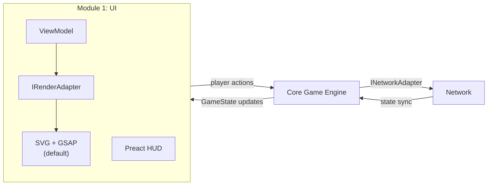
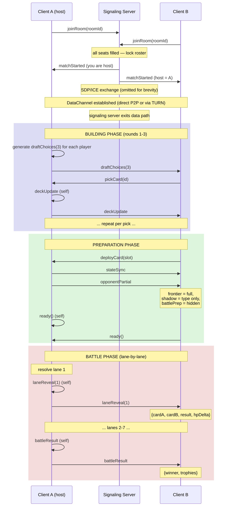
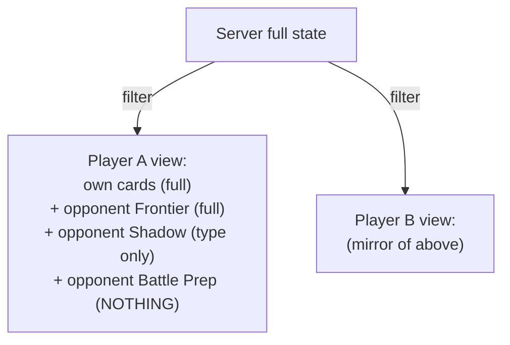
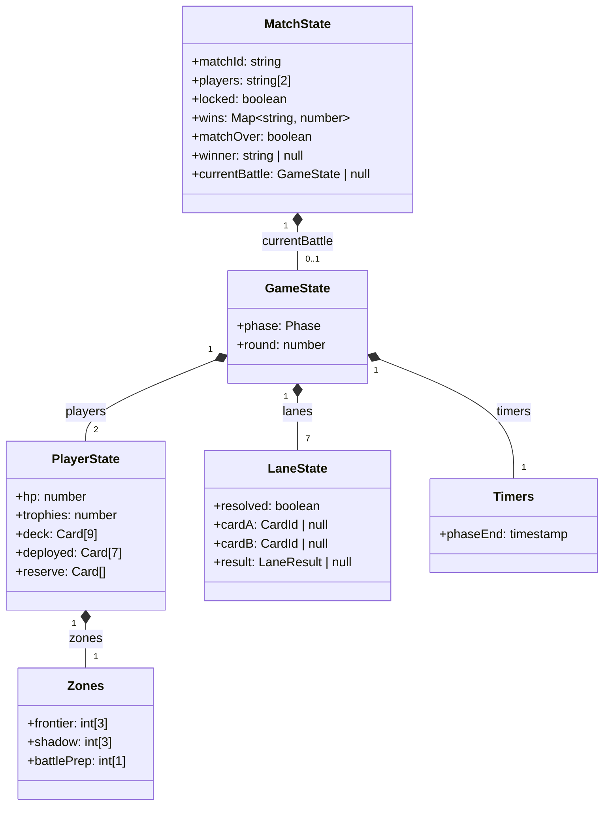
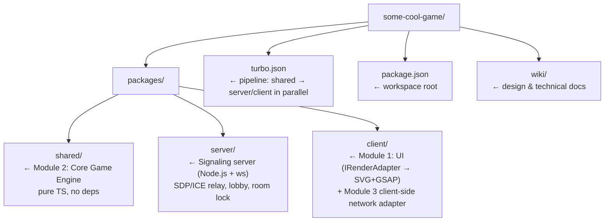

# Technical Specification — Card Battle Game

> **Version:** 1.0
> **Status:** Draft
> **Companion docs:** [GDD v4.0](GDD.md) · [Card Design](card_design.md) · [P2P Considerations](p2p_considerations.md)

---

## 1. Tech Stack

| Layer              | Choice                  | Rationale                                                                  |
| ------------------ | ----------------------- | -------------------------------------------------------------------------- |
| **Language**       | TypeScript (strict)     | Shared types between client and server; catches card-logic bugs at compile time |
| **Rendering**      | SVG + GSAP              | DOM-inspectable vector rendering with timeline animation; swappable via `IRenderAdapter` |
| **UI Overlay**     | Preact + HTM            | Thin reactive layer for HUD, menus, lobby — renders to DOM alongside the SVG board |
| **Networking**     | WebRTC DataChannels     | P2P game messages over SCTP/DTLS; no relay after connection established    |
| **Signaling**      | Node.js 20 + ws         | Minimal WebSocket server for SDP/ICE exchange and lobby management — zero game logic |
| **STUN / TURN**    | Google STUN + Coturn    | Public STUN for NAT traversal; self-hosted Coturn as TURN relay for symmetric NAT (~25–30% of users) |
| **Monorepo**       | Turborepo + pnpm        | Three packages: `client`, `server`, `shared` with single `tsconfig` base  |
| **Build (client)** | Vite 6                  | Fast HMR, native TS, handles SVG and static assets out of the box         |
| **Build (server)** | tsx (dev) / tsup (prod) | Fast dev reload; single-file production bundle                             |
| **Testing**        | Vitest + Playwright     | Unit tests for shared game logic; E2E for full client-server flows         |
| **Linting**        | Biome                   | Single tool for format + lint; faster than ESLint + Prettier               |

### Why SVG + GSAP over PixiJS

PixiJS renders to a `<canvas>` — opaque to DevTools, no DOM inspection, no CSS, and hit-testing requires manual coordinate math. For a card game with 14 cards and lane-by-lane animations, canvas performance headroom is unnecessary. SVG was chosen because:

- **DOM-inspectable** — every card is a `<g>` with `<rect>` + `<text>` children, visible in the Elements panel with live attribute editing
- **`viewBox` auto-scaling** — one `viewBox="0 0 1400 700"` declaration scales the entire board to any screen size with zero media queries
- **Single coordinate space** — all cards and effects share one coordinate system; cross-card animations (projectiles, beams between lanes) are trivial
- **GSAP timeline** — GSAP's `timeline()` sequencing maps directly to the lane-by-lane reveal pattern; `attr: {}` animates SVG attributes (stroke, r, opacity) natively

The rendering layer is abstracted behind `IRenderAdapter` (see §2.2), so PixiJS can be swapped in later if performance requirements grow (e.g., particle-heavy effects, 60fps animation of 50+ simultaneous sprites).

### Why WebRTC P2P for MVP

No dedicated game server is needed for MVP: one peer acts as host, running the Core Engine locally. This eliminates Colyseus infrastructure costs and operational complexity while the player base is small and competitive-integrity requirements are low. The architecture is already abstracted behind `INetworkAdapter`, so P2P is a clean swap with zero changes to Core or UI.

Key trade-offs are documented in [p2p_considerations.md](p2p_considerations.md). The most significant: the host peer has full visibility into all game state (cheat risk) and ~25–30% of users will fall back to TURN relay (infrastructure cost).

### Why Colyseus (future upgrade path)

When competitive integrity demands server-side anti-cheat, or when player counts exceed P2P mesh viability, swap `adapters/p2p/` for `adapters/colyseus/` — zero changes to Core Engine or UI. Colyseus provides authoritative rooms, delta-compressed state sync, reconnection, and room pairing out of the box.

---

## 2. Module Structure

Three core modules with clean interfaces between them. Any layer can be swapped independently — e.g., the network module can move from central server to P2P without touching game logic or UI.

### 2.1 Module Diagram



- **UI → Core:** "Player wants to deploy card X at slot 3" (intent)
- **Core → Network:** "Validated action, broadcast to opponent" (via adapter)
- **Network → Core:** "Opponent deployed card Y" (incoming action)
- **Core → UI:** "State updated, re-render" (new GameState)
- **ViewModel → IRenderAdapter:** "Board state changed, here's the new snapshot" (renderer-agnostic)

### 2.2 Module 1: UI

Responsible for rendering, input, and presentation. Knows nothing about networking. The rendering layer is abstracted behind `IRenderAdapter` so it can be swapped between SVG, DOM, or PixiJS without affecting game logic, networking, or HUD components.

| Sub-module              | Responsibility                                                                                    |
| ----------------------- | ------------------------------------------------------------------------------------------------- |
| `renderer/interface.ts` | `IRenderAdapter` — the contract every renderer implements (see below)                             |
| `renderer/svg/`         | **Default.** SVG + GSAP implementation: Board (`<svg viewBox>`), Card (`<g>` groups), Animator (GSAP timelines), Effects (per-card VFX via `createElementNS`) |
| `components/`           | Preact HUD overlay — HP bar, round counter, phase indicator, card tooltips, menus                 |
| `state/ViewModel`       | Derives displayable state from the Core Engine's GameState, respecting visibility zone rules      |

**Interface:** Consumes `GameState` (read-only) from Core Engine; emits player actions (`deployCard`, `pickCard`, `ready`, etc.) as intents.

#### IRenderAdapter

The boundary between renderer-agnostic code (ViewModel, HUD) and renderer-specific code (SVG elements, GSAP animations). Swapping renderer = new implementation of this interface; zero changes to Core, Network, or HUD.

```typescript
interface IRenderAdapter {
  /** Mount the renderer into a DOM container */
  mount(container: HTMLElement): void;

  /** Re-render the board from the current ViewModel snapshot */
  updateBoard(viewModel: BoardViewModel): void;

  /** Animate a card being deployed to a slot */
  playDeploy(slot: number, card: CardView): Promise<void>;

  /** Animate a lane reveal (flip + resolution) */
  playLaneReveal(lane: number, result: LaneResultView): Promise<void>;

  /** Play the card-identity-specific resolution effect */
  playResolutionEffect(lane: number, winner: CardView): Promise<void>;

  /** Tear down the renderer and clean up resources */
  destroy(): void;
}
```

`ViewModel` computes *what* to show (visibility filtering, winner, HP deltas). The renderer decides *how* to draw and animate it. This keeps game logic and presentation fully decoupled.

### 2.3 Module 2: Core Game Engine

Pure game logic — deterministic, platform-agnostic, no I/O. This is the shared brain that runs identically on client, server, or P2P host.

| Sub-module          | Responsibility                                                                                                |
| ------------------- | ------------------------------------------------------------------------------------------------------------- |
| `types/`            | All interfaces and enums: `Card`, `GameState`, `PlayerState`, `LaneResult`, `Phase`, `CardType`, `Tier`       |
| `cards/catalog`     | 25-card catalog as typed constant map — id, name, type, priority, base stats, tier scaling, ability descriptor |
| `cards/abilities`   | Pure functions for each ability's effect signature (inputs/outputs)                                            |
| `rules/lane`        | `resolveLane(cardA, cardB, context): LaneResult` — priority ordering, disrupt, shields, buffs, nukes          |
| `rules/economy`     | Phase transition logic — which picks/discards/upgrades are legal given the current round                      |
| `rules/deploy`      | Zone constraints (Frontier before Shadow), contiguous placement, Battle Prep insertion shifting                |
| `engine/PhaseManager` | State machine: BUILDING → PREP → MATCHING → BATTLE_PREP → BATTLE → RESULT                                  |
| `engine/MatchManager`  | Multi-battle match envelope — round-robin pairing schedule, trophy tracking (per-round KO or HP-lead), lobby-wait enforcement, roster-lock, and match-over condition (first player to accumulate 10 trophies) |
| `engine/Validator`  | Validates any player action against current state — anti-cheat layer when run server-side                     |

**Interface:** Exposes `applyAction(state, action): GameState`, `resolveLane()`, and `applyBattleResult(matchState, result): MatchState`. No side effects, fully testable.

### 2.4 Module 3: Network

Abstracted transport layer. Defines interfaces so the implementation can be swapped without touching game logic or rendering.

| Sub-module             | Responsibility                                                                                        |
| ---------------------- | ----------------------------------------------------------------------------------------------------- |
| `interface/`           | `INetworkAdapter` — `connect()`, `sendAction()`, `onStateUpdate()`, `onLaneReveal()`, etc.            |
| `adapters/p2p/`        | **Default (MVP).** P2P adapter — WebRTC DataChannels; host peer runs Core Engine and `MatchManager`   |
| `adapters/colyseus/`   | (Future) Central server adapter — authoritative Colyseus rooms, schema sync, room pairing              |
| `server/SignalingServer` | Lightweight Node.js + ws server — relays SDP/ICE candidates, manages lobby seats, emits `matchStarted`; drops out of the data path once peers connect |
| `messages/`            | Typed message definitions shared by all adapters                                                       |

**Matchmaking:** Rooms support **2, 4, or 6 players only** (even numbers; odd counts are rejected because they cannot form complete 1:1 pairings). All matches within a room are strictly **1:1 (one player vs. one player)**. A 4-player room runs 2 simultaneous 1:1 matches; a 6-player room runs 3.

There is no global queue — players join a named room directly via the signaling server. **The game does not start until all seats are filled**; early arrivals wait in a lobby state and no game actions are accepted until the room reaches capacity. **The player roster is locked at game start** — no joins or substitutions are permitted once the match is in progress.

**Host peer election:** The first player to join the room becomes the host peer. The host runs `MatchManager` and the Core Engine locally, enforcing all game rules and visibility filtering. Host role is locked at `matchStarted` and does not transfer mid-match. If the host disconnects, the match is abandoned (reconnection window: 60 s); host migration is out of scope for MVP.

Within a room, pairing follows a **round-robin schedule** so that every player faces every other player in turn. `SignalingServer` handles lobby seat management only; all match lifecycle concerns (round-robin scheduling, win tracking, lobby-wait, roster-lock, match-over detection) are the responsibility of `engine/MatchManager` running on the host peer.

**Mesh topology:** 2- and 4-player rooms use full P2P mesh (every peer ↔ every peer). 6-player rooms use a **host-peer star topology** — all non-host peers connect only to the host, and the host relays messages between pairings. This caps each non-host peer at one DataChannel connection regardless of room size.

**Interface:** UI and Core Engine interact with Network only through `INetworkAdapter`. Swapping from Colyseus to P2P requires zero changes to game logic or rendering.

---

## 3. Authority Model

The **host peer** is the single source of truth for MVP. It runs the Core Engine locally, validates all actions, enforces visibility rules, and drives phase transitions. Non-host peers are view layers that send intents and render confirmed state.

> In the future Colyseus path, this role moves to a dedicated server — no changes to Core Engine or UI are required.

### Host Peer owns

| Concern                | Detail                                                             |
| ---------------------- | ------------------------------------------------------------------ |
| Card resolution        | All lane outcomes computed via `shared/rules/lane`                 |
| Visibility enforcement | Hidden card data never forwarded to opponent until reveal time     |
| Deploy validation      | Every placement checked against zone rules and deck contents       |
| Economy validation     | Draft picks, discards, upgrades validated against phase rules      |
| Timers                 | Phase duration enforced; auto-advance on timeout                   |
| Randomness             | Card draft pool (3 random from 25) generated by host peer          |

### Client owns

| Concern                | Detail                                                             |
| ---------------------- | ------------------------------------------------------------------ |
| Animation pacing       | Controls reveal animation speed (within server timeout)            |
| UI layout              | Card arrangement, drag targets, cosmetic preferences               |
| Input                  | Which card to play where — sent as intent, validated by server     |

Because Core Engine is a standalone module, it runs identically whether hosted on a dedicated server (Colyseus) or on a host peer (P2P). The network adapter determines *where* it runs, not *how*.

---

## 4. Data Flow

### 4.1 Match Lifecycle



The diagram above shows a single battle between two peers. **Client A is the host peer** — it runs `MatchManager` and the Core Engine locally, pushes state to B over a WebRTC DataChannel. The signaling server is only involved during room formation and SDP/ICE exchange; it carries no game traffic. A full match consists of repeated battles until one player accumulates 10 trophies; between battles `MatchManager` resets `GameState` while preserving `MatchState.wins`. The match does not begin until `MatchState.locked` is true (all seats filled).

### 4.2 Key Message Types

| Direction       | Message            | Payload                                                        |
| --------------- | ------------------ | -------------------------------------------------------------- |
| Server → Client | `draftChoices`     | `Card[3]` — three cards to pick from                           |
| Client → Server | `pickCard`         | `{ cardId }`                                                   |
| Client → Server | `deployCard`       | `{ cardId, slot }`                                             |
| Client → Server | `insertBattlePrep` | `{ cardId, position }`                                         |
| Client → Server | `discardCard`      | `{ cardId }` (Replacement phase)                               |
| Client → Server | `upgradeCard`      | `{ cardId }` (Reinforcement phase)                             |
| Client → Server | `ready`            | `{}` — signals phase completion                                |
| Server → Client | `stateSync`        | Delta-compressed state patch (own full state)                  |
| Server → Client | `opponentPartial`  | Visibility-filtered opponent board                             |
| Server → Client | `laneReveal`       | `{ lane, cards: [Card, Card], result: LaneResult }`            |
| Server → Client | `battleResult`     | `{ winner: string \| null, hpA, hpB, trophies: [number, number] }` — `winner` is `null` on Double KO or equal-HP tie |

### 4.3 Visibility Filtering

The server maintains full game state but **filters outgoing data per player**:



Opponent card IDs and stats in Shadow/BattlePrep zones are **never serialized to the wire**. This is the primary anti-cheat boundary.

---

## 5. State Schema



> `MatchState` is the long-lived envelope. While `locked` is `false` the room is in lobby state — no game actions are accepted. Once all seats fill, `locked` becomes `true` and the `players` list is immutable for the rest of the match. `GameState` resets at the start of each new battle. The `trophies` field in `PlayerState` mirrors `MatchState.wins` for use in per-battle UI and `battleResult` messages.

---

## 6. Build & Dev Workflow

### Directory Layout



### Dev Commands

| Command      | Effect                                                          |
| ------------ | --------------------------------------------------------------- |
| `pnpm dev`   | Starts all three packages (shared watch + server + client)      |
| `pnpm test`  | Runs Vitest across all workspaces                               |
| `pnpm build` | Production build: shared → server bundle + client static assets |

---

## 7. Open Technical Decisions

| Decision                  | Options                                | Status / Recommendation                                                   |
| ------------------------- | -------------------------------------- | ------------------------------------------------------------------------- |
| Rendering engine          | PixiJS 8, SVG + GSAP, DOM + GSAP      | **Decided:** SVG + GSAP — DOM-inspectable, `viewBox` scaling, single coordinate space. PixiJS available as future upgrade via `IRenderAdapter` if performance requires it |
| Animation library         | gsap, @pixi/animate, custom tweens     | **Decided:** GSAP — confirmed by prototype; timeline sequencing fits lane-by-lane reveals |
| Networking (MVP)          | WebRTC P2P, Colyseus, raw WebSocket    | **Decided:** WebRTC DataChannels — no game-server cost, INetworkAdapter makes Colyseus a future swap. See [p2p_considerations.md](p2p_considerations.md) for risks |
| P2P NAT traversal         | STUN only, STUN + TURN                 | **Decided:** Google public STUN + self-hosted Coturn TURN. TURN fallback required for ~25–30% of users behind symmetric NAT |
| Host peer election        | First joiner, lowest latency           | **Decided:** First joiner is host; role locked at `matchStarted`. Host migration not supported in MVP — match abandoned if host disconnects |
| DataChannel configuration | Single channel, split channels         | **Decided:** Two channels — Channel 1 (reliable + ordered) for game moves; Channel 2 (unreliable) for non-critical UI hints |
| Persistent storage        | None (MVP), PostgreSQL, SQLite         | None for MVP; add PostgreSQL via Drizzle ORM when accounts needed          |
| Reconnection window       | Custom                                 | 60s grace period; non-host peer may rejoin. Host reconnection not supported (match abandoned) |
| Turn timer duration       | Fixed vs. configurable                 | 30s prep phase, 15s battle prep; configurable in `shared/config`          |
| Asset pipeline            | Inline SVG, external images, sprite sheets | Inline SVG paths for card icons; external images loaded directly for future card art. No sprite sheet tooling needed with SVG renderer |
| Card art (placeholder)    | Colored shapes, text-only              | **Decided:** Inline SVG icons per card identity (geometric, type-colored) |
